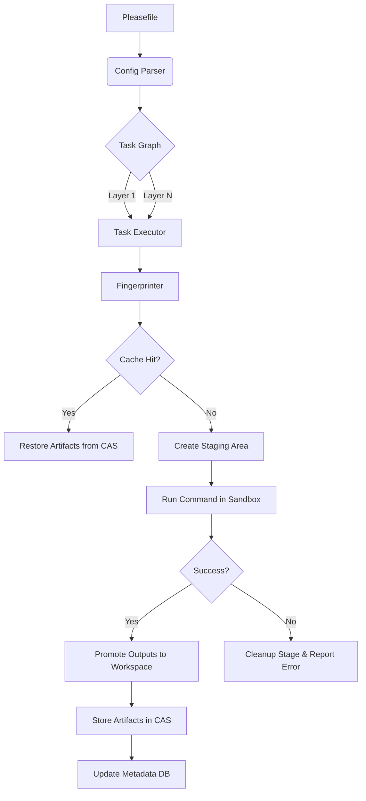

# Please v0.1 Architecture Deep Dive

Please is a high-performance, hermetically-sealed build system and task runner designed for determinism, parallelism, and reliable caching. This document provides a detailed overview of its internal architecture and design principles.

## Core Principles

- **Determinism**: Unchanged inputs, environment variables, and task commands must never trigger a recomputation.
- **Hermeticity**: Tasks should be isolated from the host system as much as possible to prevent "it works on my machine" syndromes.
- **Atomicity**: Task execution is transactional. Failed tasks never pollute the workspace or the cache.
- **Reproducibility**: Any cache hit must be indistinguishable from a fresh local execution.

---

## Component Architecture

The system is split into three main Rust crates:

1. **`please-cli`**: The entry point. Handles command-line argument parsing, logging initialization, and orchestrates the execution.
2. **`please-core`**: The "brain" of the system.
   - **Configuration**: Parses `Pleasefile` into a validated `PleaseFile` model.
   - **Task Graph**: Builds a Directed Acyclic Graph (DAG) using `petgraph`.
   - **Fingerprinting**: Computes BLAKE3 hashes of all task inputs.
   - **Executor**: Manages the lifecycle of a task (staging, execution, promotion).
3. **`please-cache`**: The storage layer.
   - **Metadata**: A SQLite database storing `ExecutionRecord`s (fingerprints, stdout/stderr, artifact maps).
   - **Content Addressable Storage (CAS)**: A file-backed store where artifacts are saved under their content hashes.

---

## The Execution Lifecycle

When a user runs `please run <target>`, the system follows these steps:

### 1. Graph Construction & Validation

- Load the `Pleasefile`.
- Build a DAG where nodes are tasks and edges are dependencies.
- Perform a topological sort to detect cycles and group tasks into **Execution Layers**. Tasks within a layer have no inter-dependencies and are executed in parallel.

### 2. Task Fingerprinting

For each task, a unique `TaskFingerprint` is computed based on:
- The task's unique name.
- The literal run command (shell or args).
- Environment variables declared in the task spec.
- **Input File Contents**: All files matching the `inputs` patterns are hashed using BLAKE3.
- Declared output paths.

### 3. Cache Lookup

Before executing, the system queries the `LocalArtifactStore` using the task name and its fingerprint.
- **Hit**: Restore the declared outputs from the CAS into the workspace and skip execution.
- **Miss**: Proceed to execution.

### 4. Staging & Execution

To ensure hermeticity:
1. **Staging**: A temporary directory (`.please/stage/<task-id>`) is created. A shallow copy of the workspace is mirrored into the stage.
   - **Exclusions**: Directories like `.please/` (metadata/cache) and `.git/` are strictly excluded from the stage to ensure a clean build environment.
2. **Isolation**:
   - **Strict (Linux)**: Uses `bubblewrap` (`bwrap`) to create a namespace where only the stage directory is writable, network is disabled, and the environment is scrubbed.
   - **Best Effort**: Runs the command in the stage directory with a cleared environment (preserving only essentials like `PATH` and `HOME`).
3. **Command Execution**: The `run` command is executed inside the stage.

### 5. Atomic Output Promotion
If and only if the task command succeeds (exit code 0):

- The system verifies all declared `outputs` exist in the staging area.
- Existing files in the workspace at those paths are backed up in a transactional directory (`.please/tx/`).
- Staged outputs are moved into the real workspace.
- If promotion fails midway, the system attempts to roll back to the backed-up state.

### 6. Archiving

The newly produced outputs are hashed and stored in the CAS. A new execution record is committed to the SQLite database, mapping the fingerprint to these artifacts.

---

## Technical Data Flow

## Hermeticity Model

| Feature | Strict Isolation (Linux) | Best Effort (Other OS) |
| :--- | :--- | :--- |
| **Filesystem** | Read-only root, Writable Stage | Regular path isolation |
| **Network** | Disabled (unshare-net) | Enabled |
| **Env Vars** | Strict Whitelist + Task Env | Strict Whitelist + Task Env |
| **Process** | New PID namespace | Standard Child Process |

## Caching Implementation

### Metadata Schema (SQLite)

- `task_name`: Primary Key.
- `fingerprint`: Primary Key.
- `artifacts_json`: A map of workspace-relative paths to their CAS object hashes.
- `stdout/stderr`: Captured logs from the successful execution.

### Artifact Store (CAS)

- Files are stored in `.please/cache/objects/<hash>`.
- If an output is a directory, the system recurses to hash and store its entire structure.
- **Deduplication**: Identical files across different tasks or versions share the same physical object in the CAS.
