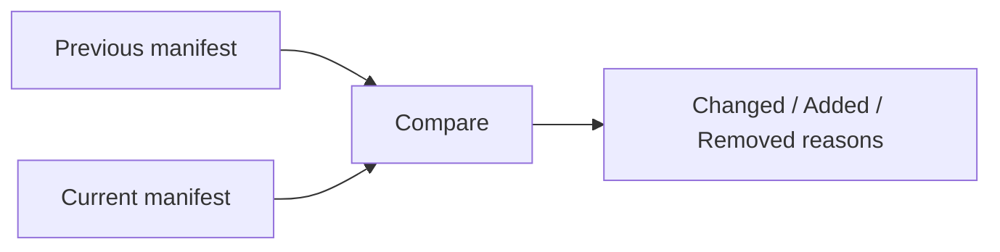

# Cache Explainability

Use `--explain` to understand why a graph task reran.

```bash
please run build --explain
```



Typical reasons include:

- `input changed`
- `env changed`
- `task parameter changed`
- `command changed`
- `interactive mode bypass`
