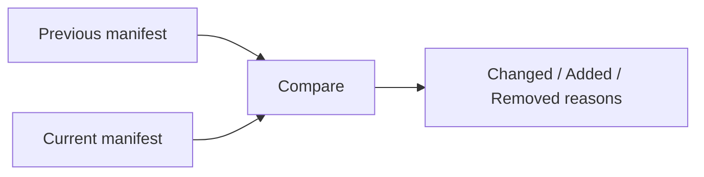

# Cache Explainability

Use `--explain` to understand why a graph task reran.

```bash
broski run build --explain
```



Typical reasons include:

- `input changed`
- `env changed`
- `task parameter changed`
- `command changed`
- `interactive mode bypass`

## Explain workflow for migration debugging

1. Run target once.
2. Run same target with `--explain`.
3. Change one thing only, for example a single input file.
4. Run again with `--explain`.
5. Verify exactly one expected miss reason appears.

```bash
broski run build
broski run build --explain
echo "// change" >> src/main.rs
broski run build --explain
```

## Secret handling

If you use `@secret_env`, explain output remains actionable without exposing secret values.

Expected:

- secret-derived changes are reported generically
- secret values are redacted from output and logs
