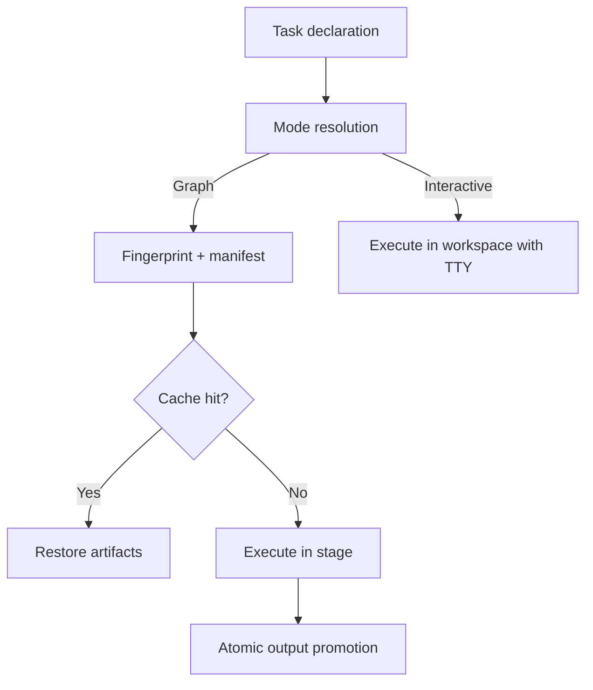

# Why Broski Exists

Broski was built to close the gap between simple command runners and deterministic build systems.

## The core gap

Most teams use one of these patterns:

- **Make/Just**: fast to adopt, but limited explainability and weak determinism.
- **Heavy build systems**: strong determinism, but high complexity and onboarding cost.

Broski aims for the middle:

- shell-first authoring
- deterministic graph execution when declared
- interactive mode for local DX
- explicit cache miss reasoning

## What teams struggle with today

### 1) “Why did this rebuild?”

Without manifest diffs, CI reruns are hard to reason about.  
Broski answers with `--explain` against previous manifests.

### 2) “Why did this pass locally but fail in CI?”

Implicit inputs cause nondeterministic behavior.  
Broski requires explicit contracts for graph-mode tasks.

### 3) “Why is my local runner corrupting outputs on failure?”

Partial outputs can leak from failed executions.  
Broski uses transactional output promotion to keep artifact state safe.

## Execution model at a glance

## Where Broski is stronger than Make/Just

| Problem | Make | Just | Broski |
| --- | --- | --- | --- |
| Content-level cache keys | No | No | Yes |
| Structured cache miss reasons | Limited | No | Yes |
| Transaction-safe output promotion | No | No | Yes |
| Interactive local task support | Yes | Yes | Yes |
| Secret-safe explain output | No | No | Yes |

## Where to go next

- [Engine Overview](./engine-overview)
- [Cache Explainability](./cache-explain)
- [Migration Playbook](../operations/migration)
