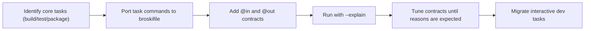

import ToolComparison from '@site/src/components/ToolComparison';

# Make vs Just vs Broski

This page answers one practical question: if your team already uses Make or Just, what changes when you move to Broski?

## What problems Broski solves

Traditional task runners are excellent at command orchestration, but they leave core reliability gaps for modern CI and monorepos:

- timestamp-driven rebuild ambiguity (`make` can rebuild too much or too little)
- low explainability for reruns (especially after env or argument changes)
- no transactional output safety (partial outputs after failed runs)
- no built-in deterministic content fingerprinting

Broski keeps simple task authoring while adding deterministic cache keys, explainability, and ACID-safe output promotion.

## Same intent, different guarantees

### Define a build task

<ToolComparison
  pleaseLanguage="bash"
  makeLanguage="makefile"
  justLanguage="makefile"
  pleaseCode={`build [target] [mode="release"]:\n    @in src/**/* Cargo.toml\n    @out dist/{{ target }}\n    @requires cargo\n    cargo build --bin {{ target }} --{{ mode }}`}
  makeCode={`build:\n\tcargo build --release`}
  justCode={`build target mode=\"release\":\n  cargo build --bin {{target}} --{{mode}}`}
/>

### Add a local dev task

<ToolComparison
  pleaseLanguage="bash"
  makeLanguage="makefile"
  justLanguage="makefile"
  pleaseCode={`dev:\n    @mode interactive\n    npm run dev`}
  makeCode={`dev:\n\tnpm run dev`}
  justCode={`dev:\n  npm run dev`}
/>

### Trigger with arguments

<ToolComparison
  pleaseLanguage="bash"
  makeLanguage="makefile"
  justLanguage="makefile"
  pleaseCode={`broski build api debug\nplease run build --explain`}
  makeCode={`make build TARGET=api MODE=debug`}
  justCode={`just build api debug`}
/>

## Why teams choose Broski for CI

| Capability | Make | Just | Broski |
| --- | --- | --- | --- |
| Content hashing | No | No | Yes (BLAKE3) |
| DAG graph execution | Partial/manual | Basic | First-class |
| Interactive mode | Native | Native | Native |
| Cache explainability | No | No | `--explain` |
| ACID output promotion | No | No | Yes |
| Cache bypass reasoning | No | No | Yes |
| Secret-aware explain output | No | No | Yes |

## Migration flow (recommended)



## Makefile to broskifile conversion examples

### Example A: simple build + test

```makefile title="Makefile"
build:
    cargo build --release

test:
    cargo test
```

```bash title="broskifile"
version = "0.5"

build:
    @in src/**/* Cargo.toml Cargo.lock
    @out target/release
    cargo build --release

test: build
    @in src/**/* Cargo.toml Cargo.lock tests/**/*
    @out .broski/stamps/test.ok
    cargo test
    touch .broski/stamps/test.ok
```

### Example B: env-sensitive command

```makefile title="Makefile"
release:
    RUSTFLAGS="-D warnings" cargo build --release
```

```bash title="broskifile"
release:
    @in src/**/* Cargo.toml Cargo.lock
    @out target/release
    @env RUSTFLAGS=-D warnings
    cargo build --release
```

## Justfile to broskifile conversion examples

### Example A: parameterized build

```makefile title="justfile"
build target mode="release":
  cargo build --bin {{target}} --{{mode}}
```

```bash title="broskifile"
build [target] [mode="release"]:
    @in src/**/* Cargo.toml Cargo.lock
    @out dist/{{ target }}
    cargo build --bin {{ target }} --{{ mode }}
```

### Example B: interactive dev workflow

```makefile title="justfile"
dev:
  docker compose up
```

```bash title="broskifile"
dev:
    @mode interactive
    docker compose up
```

## Decision checklist: when to choose graph mode

Use graph mode when:

- task outputs are meaningful artifacts you want to reuse
- rerun cost is non-trivial (build/test/package)
- you need cache explainability for CI debugging

Use interactive mode when:

- process is long-running (dev server, watcher, REPL)
- task should stream output directly to terminal
- caching is intentionally bypassed

## Next reads

- [Engine Overview](../architecture/engine-overview)
- [Cache Explainability](../architecture/cache-explain)
- [Migration Playbook](../operations/migration)
