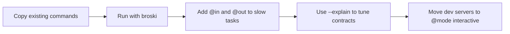

import ToolComparison from '@site/src/components/ToolComparison';

# Make vs Just vs Broski

This page answers one practical question: what do you gain if your commands already work in Make/Just?

## The practical wedge

Broski is strongest when you need all three together:

1. command-style task authoring
2. cache reuse for expensive tasks
3. explicit rerun reasons via `--explain`

## Same intent, different visibility

### Build task

<ToolComparison
  broskiLanguage="bash"
  makeLanguage="makefile"
  justLanguage="makefile"
  broskiCode={`build:\n    @in src/**/* Cargo.toml Cargo.lock\n    @out target/release\n    cargo build --release`}
  makeCode={`build:\n\tcargo build --release`}
  justCode={`build:\n  cargo build --release`}
/>

### Dev task (interactive)

<ToolComparison
  broskiLanguage="bash"
  makeLanguage="makefile"
  justLanguage="makefile"
  broskiCode={`dev:\n    @mode interactive\n    npm run dev`}
  makeCode={`dev:\n\tnpm run dev`}
  justCode={`dev:\n  npm run dev`}
/>

## Why teams switch incrementally

- You can copy commands first, then add `@in`/`@out` later.
- `--explain` removes guesswork on cache misses.
- Output promotion avoids partial writes after failed graph tasks.

## Recommended migration flow

## Keep expectations realistic

Broski is not trying to replace every platform concern yet (for example remote cache and enterprise policy controls). This release line focuses on local/small-team reliability and rerun clarity.

## Next reads

- [Migration Playbook](../operations/migration)
- [Cache Explainability](../architecture/cache-explain)
- [Commands and Flags](../cli/commands)
