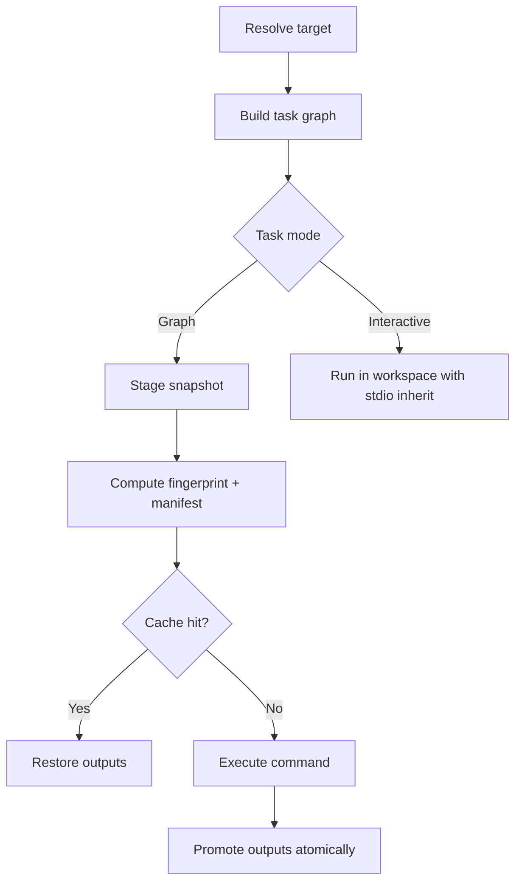

# Engine Overview

Broski has two task modes:

- **Graph mode**: staged, cached, deterministic, output-validated.
- **Interactive mode**: direct workspace execution with inherited TTY.

## Determinism Contract

Graph tasks must declare inputs and outputs. The runner fingerprints relevant execution state, including:

- command
- resolved variables and parameters
- explicit environment keys
- input file content hashes
- mode/isolation metadata
